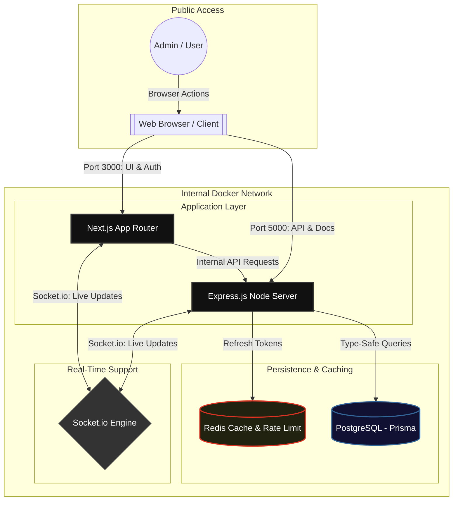
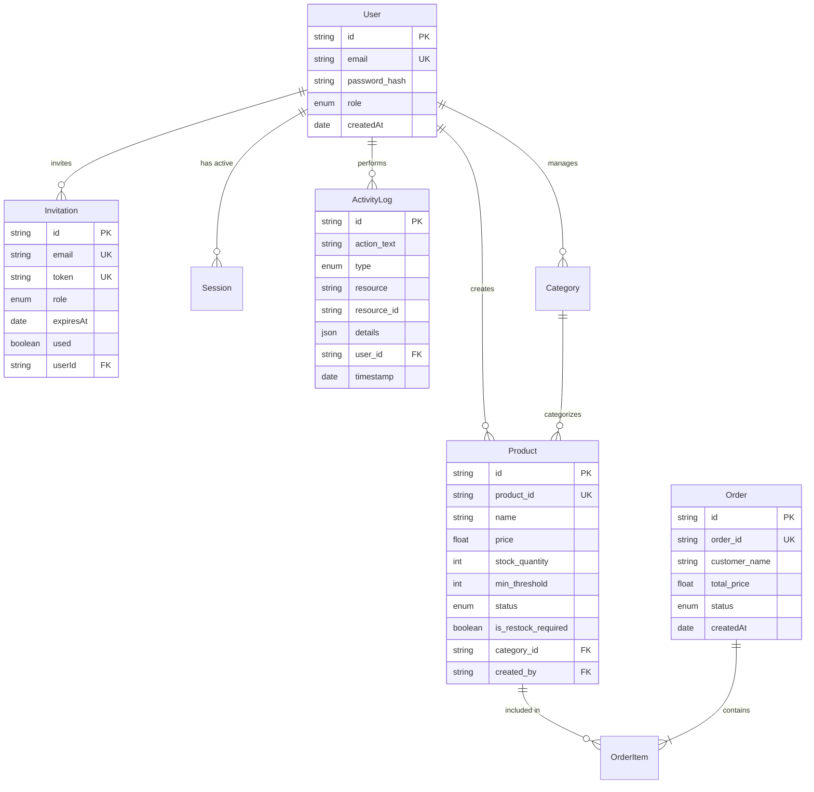
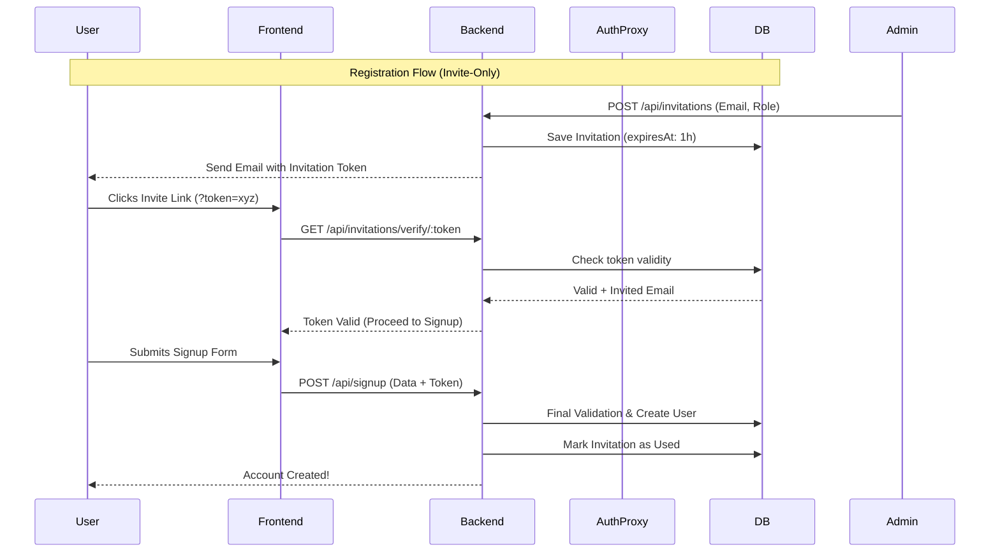
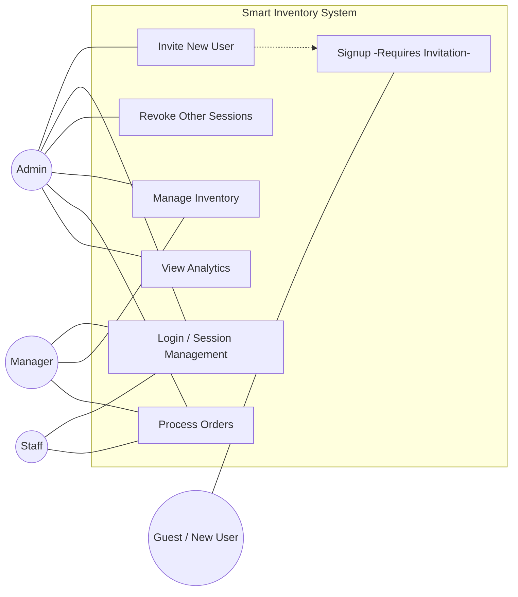

# 🚀 Smart Inventory Management System

[](https://nextjs.org/)
[](https://tailwindcss.com/)
[](https://expressjs.com/)
[](https://www.prisma.io/)
[](https://www.postgresql.org/)
[](https://redis.io/)
[](LICENSE)

A high-performance, enterprise-grade inventory management solution designed for real-time tracking, automated restock management, and comprehensive order analytics. This system is built for speed, scalability, and developer excellence, now powered by **PostgreSQL** and **Prisma ORM**.

---

## 🌐 Live Deployment

| Service               | URL                                                                                                  |
| :-------------------- | :--------------------------------------------------------------------------------------------------- |
| **Frontend**          | [https://smart-inventory.sazzad.dev](https://smart-inventory.sazzad.dev)                             |
| **API Documentation** | [https://api.smart-inventory.sazzad.dev/api-docs/](https://api.smart-inventory.sazzad.dev/api-docs/) |

### 🔑 Demo Credentials

| Role        | Email              | Password     |
| :---------- | :----------------- | :----------- |
| **Admin**   | `admin@demo.com`   | `admin123`   |
| **Manager** | `manager@demo.com` | `manager123` |

---

## 🎬 Project Demo


---

## ✨ Features

### 🛡️ Advanced Security

- **Role-Based Access Control (RBAC)**: Fine-grained permissions for Admin, Manager, and Staff roles.
- **Invite-Only Enrollment**: Advanced membership security—new users can only register via authenticated email invitations with expiring secure tokens.
- **NextAuth 5 (Beta)**: Secure, modern authentication with JWT rotation and "Refresh Lock" mechanisms.
- **Rate Limiting**: Redis-backed protection against brute-force and API abuse.
- **Validation**: Strict schema validation using Zod on both frontend and backend.

### 📊 Intelligence & Monitoring

- **Real-time Synchronization**: Live updates for Activity Logs and Order Tables via Socket.io, ensuring all staff see changes instantly.
- **Real-time Dashboard**: Live updates on stock levels and system metrics.
- **Remote Session Revocation**: Admins can instantly monitor and terminate any active user session across all devices.
- **Automated Restock Queue**: Intelligent identification of low-stock items with a dedicated resolution workflow.
- **Activity Audit**: Persistent, real-time logging of all critical system actions with **Undo/Redo** support for product deletions.

### 📦 Operational Excellence

- **Inventory Management**: Comprehensive CRUD for products with multi-attribute tracking, image support, and bulk operations.
- **Deletion Safeguards**: Intelligent business logic prevents the deletion of products that are linked to existing order history.
- **Order Lifecycle**: End-to-end tracking from pending to delivery with automated stock adjustments and real-time status updates.
- **AI Analytics**: Intelligent dashboard insights and "Magic Tips" using **OpenRouter** (LLM) for proactive inventory management.
- **Swagger UI**: Interactive API documentation for seamless integration.

### 🎨 Modern UI/UX

- **Skeleton Loading States**: Professional, content-aware loading skeletons (including specialized table skeletons) replace global spinners.
- **Component-Driven Tables**: Reusable, modular `DataTable` and `FilterBar` logic with URL-synced state management.
- **Glassmorphic Action Modals**: Custom-themed confirmation dialogs replacing native browser popups for a premium, unified look.
- **Tailwind CSS 4**: Utilizing the latest CSS capabilities for a blazing-fast, modern interface.
- **Shadcn UI**: High-quality, accessible components for a premium look and feel.
- **Mobile First**: Fully responsive design optimized for all device sizes.

---

## 🛠️ Tech Stack

### Frontend

- **Framework**: Next.js 16.2 (App Router)
- **State Management**: Zustand & SWR
- **Auth**: NextAuth.js v5 (Beta)
- **Styling**: Tailwind CSS 4, Lucide Icons, Shadcn UI
- **Real-time**: Socket.io-client
- **Hooks/Forms**: React Hook Form, Sonner (Toasts)

### Backend

- **Runtime**: Node.js 22 (TypeScript)
- **Framework**: Express 5.2.x
- **ORM**: Prisma 7.8
- **Database**: PostgreSQL 16
- **Caching/Rate Limit**: Redis
- **Docs**: Swagger UI (OpenAPI 3.0)
- **Logging**: Winston, Morgan
- **Real-time**: Socket.io
- **AI Provider**: OpenRouter (GPT-4o/Claude 3.5)
- **Validation**: Zod (Shared schemas)

---

## 📐 Architecture & Workflow

### 🏙️ High-Level Architecture (Infrastructure)

Shows the Docker service orchestration, internal networking, and the relationship between the Frontend, Backend, Redis, and PostgreSQL.



### 🗄️ Entity Relationship Diagram (ERD)

The database schema is migrated to PostgreSQL using Prisma for high data integrity and efficient auditing.



### 🔐 Authentication & Token Rotation

A detailed sequence showing how the Next.js Middleware and Auth Proxy layer handle JWT rotation and session persistence securely.



### 👥 Role-Based Access Control (RBAC)

Visualizes the permission hierarchy (Staff → Manager → Admin) and the specific system actions available to each user role.



---

## 🧪 Testing Architecture

The project maintains a rigorous quality standard with a comprehensive suite of unit and integration tests powered by **Jest**.

### 🛠️ Coverage Metrics

- **Statements**: >95%
- **Branches**: >80%
- **Functions**: >90%
- **Lines**: >95%

### 📂 Test Suites

The backend includes over **30 specialized test files** covering:

- **Controllers**: Unit tests for Auth, Product, Order, Category, and Dashboard logic.
- **Services**: Business logic validation including Undo/Redo state management and staff permission guards.
- **Integrations**: Full API flow validation for Authentication, Inventory, and Order workflows.
- **Auditing**: Verification of real-time event broadcasting and activity logging accuracy.

### 🚀 Running Tests

```bash
cd backend
pnpm test          # Run all tests
pnpm run test:watch  # Watch mode
pnpm run test:coverage # Generate coverage report
```

---

## ⚙️ Local Development

### 📋 Prerequisites

- **Node.js**: v20+
- **pnpm**: v9+
- **Docker**: For running PostgreSQL/Redis easily

### 1. Repository Setup

```bash
git clone https://github.com/sazzad4677/Smart-Inventory-System.git
cd Smart-Inventory-System
pnpm install
```

### 2. Environment Configuration

Initialize your environment variables from the templates:

```bash
# Backend
cp backend/.env.example backend/.env.local

# Frontend
cp frontend/.env.example frontend/.env.local
```

### 3. Database Migration & Seeding

Setup your PostgreSQL database and populate it with sample data:

```bash
cd backend
npx prisma generate
npx prisma migrate dev --name init
pnpm run seed
```

### 4. Running the App

From the root directory:

```bash
pnpm dev
```

- **Frontend**: `http://localhost:3000`
- **Backend**: `http://localhost:5000`
- **API Docs**: `http://localhost:5000/api-docs`

---

## 🐳 Docker Architecture

The project leverages a multi-container Docker architecture to ensure environment consistency across development and production.

### 📦 Services Orchestration

- **`frontend`**: Next.js 16 app.
- **`backend`**: Express API server.
- **`postgres`**: Primary relational database.
- **`redis`**: Cache and rate limiting.

### 🚀 Deployment Commands

From the root directory, spin up the entire ecosystem:

```bash
docker compose up --build
```

---

## 🚀 Deployment & Infrastructure

For a detailed guide on moving this project to production, covering **PostgreSQL Scaling**, **Redis Optimization**, and **CI/CD Pipelines**, please refer to our:

👉 **[Technical Architecture Deep-Dive](./docs/ARCHITECTURE_GUIDE.md)**
👉 **[Deployment & Infrastructure Guide](./docs/DEPLOYMENT.md)**

---

## 🚀 Production Deployment

To run the optimized production build locally:

```bash
docker compose -f docker-compose.prod.yml up --build -d
```

### Features of Production Build

- **Optimized Frontend**: Next.js standalone mode with minified assets.
- **Compiled Backend**: TypeScript source compiled to optimized JavaScript.
- **Enhanced Security**: Auth.js strict host verification and session monitoring enabled.

---

## 🧪 Quality Standards

- **TypeScript**: 100% type safety across the monorepo.
- **Commits**: Conventional Commits enforced via **Husky** & **Commitlint**.
- **Linting**: ESLint & Prettier for consistent code style.

---

## 📄 License

This project is licensed under the [ISC License](LICENSE).
